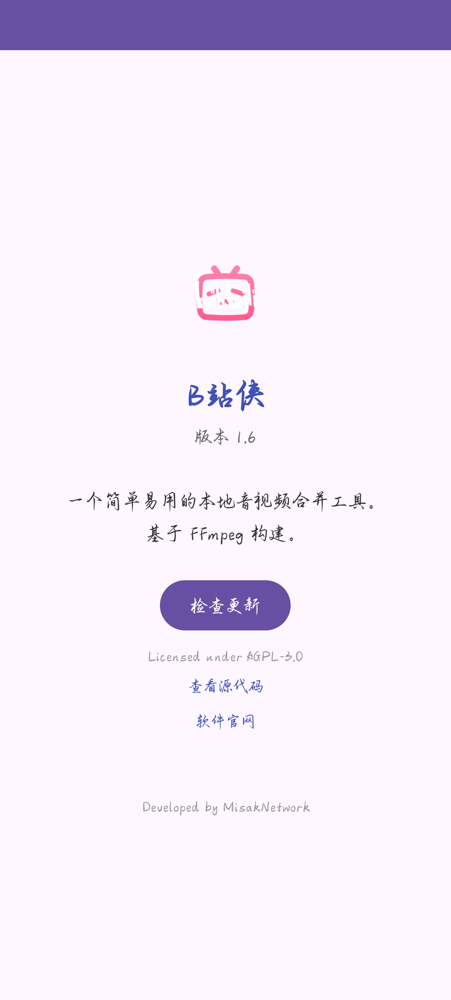

# B站侠 (BiliXia)

> 🎬 一个简单易用的本地音视频合并工具，基于 FFmpeg 构建。

🌐 [项目主页](https://bilixia.misaknetwork.top/) 
· 📥 [下载最新版](https://github.com/MikotoNetwork/BiliXia//releases)
[](https://github.com/misaknetwork/BiliXia/actions/workflows/CI.yml)
[](LICENSE)
[](https://www.android.com/)
[](https://developer.android.com/)

B站侠是一个轻量的 Android 应用，用于把**独立的视频文件和音频文件**合并成一个完整的 MP4。所有处理都在本地完成，**不上传任何文件到服务器**，保护你的隐私。

---

## ✨ 功能特性

- 🎞 **音视频合并** —— 把任意视频与音频轨道合并为 MP4
- 🚀 **极速处理** —— 视频流直接 `copy`，不重新编码，速度极快
- 📁 **独立输出目录** —— 结果保存到 `Android/data/top.misaknetwork.bilixia/files/Movies/BXia/`
- 🕒 **时间戳命名** —— `B站侠_YYYYMMDD_HHMMSS.mp4`，永不覆盖
- 📱 **相册自动扫描** —— 合并完成后可在相册中直接查看
- 🔄 **内置自动更新** —— 基于 GitHub Releases 检查新版本
- 🌙 **简洁界面** —— 三键操作：选视频 → 选音频 → 开始合并

---

## 📸 截图

> 待补充

| 主界面 | 合并中 | 关于页面 |
| :---: | :---: | :---: |
|  |  |  |

---

## 📥 下载安装

前往 [Releases 页面](https://github.com/MikotoNetwork/BiliXia//releases) 下载最新版 APK 安装即可。

**系统要求：**

- Android 8.0 (API 26) 及以上
- 建议使用 arm64-v8a 架构设备

---

## 📖 使用说明

1. 打开 B站侠
2. 点击 **选择视频**，从系统中挑选一个视频文件
3. 点击 **选择音频**，挑选需要叠加的音频文件
4. 点击 **开始合并**，等待进度条走完
5. 合并完成后，视频会自动出现在相册中；也可以从文件管理器进入：
```

Android/data/top.misaknetwork.bilixia/files/Movies/BXia/

```

---

## 🛠 构建方法

### 环境要求

- JDK 17
- Android SDK (compileSdk 34)
- Gradle 8.2+

### 本地构建

```bash
# 克隆仓库
git clone https://github.com/MikotoNetwork/BiliXia/.git
cd BiliXia

# 编译 Debug 版
./gradlew assembleDebug

# 输出 APK 位于
# app/build/outputs/apk/debug/app-debug.apk
```

云端构建（GitHub Actions）

仓库已配置好 CI，每次 push 到 main 分支都会自动编译，产物在 Actions 页面的 Artifacts 中下载。

发布新版本

```bash
# 1. 修改 app/build.gradle 中的 versionCode 和 versionName
# 2. 提交代码
git add *
git commit -m "release: v1.5"
git push

# 3. 打 tag 并推送，会自动触发 Release 工作流
git tag v1.5
git push origin v1.5
```

Actions 会自动编译 APK 并挂到 Release 上，App 内的更新检查器会检测到新版本。

---

## 🧱 技术栈

组件 说明
Java 全部业务逻辑<br>
FFmpegKit (ffmpeg-kit-full) 音视频合并核心<br>
AndroidX AppCompat、Activity Result API<br>
GitHub Actions 自动化构建与发布

---

## 📂 项目结构

```
BiliXia/
├── app/
│   ├── src/main/
│   │   ├── java/top/misaknetwork/bilixia/
│   │   │   ├── MainActivity.java          # 主界面
│   │   │   ├── About.java                 # 关于页面
│   │   │   ├── tool/
│   │   │   │   └── AudioVideoMuxer.java   # 合并核心逻辑
│   │   │   └── update/
│   │   │       └── UpdateChecker.java     # 自动更新
│   │   ├── res/
│   │   │   ├── layout/                    # 布局文件
│   │   │   ├── drawable-*/                  # 应用图标
│   │   │   └── xml/file_paths.xml         # FileProvider 配置
│   │   └── AndroidManifest.xml
│   └── build.gradle
├── .github/workflows/
│   ├── build.yml                          # 日常编译
│   └── release.yml                        # 打 tag 时发布 Release
├── LICENSE
└── README.md
```

---

## 📜 开源许可证

本项目采用 GNU Affero General Public License v3.0 (AGPL-3.0) 发布。

```
Copyright (C) 2026 MisakNetwork

This program is free software: you can redistribute it and/or modify
it under the terms of the GNU Affero General Public License as published
by the Free Software Foundation, either version 3 of the License, or
(at your option) any later version.

This program is distributed in the hope that it will be useful,
but WITHOUT ANY WARRANTY; without even the implied warranty of
MERCHANTABILITY or FITNESS FOR A PARTICULAR PURPOSE. See the
GNU Affero General Public License for more details.
```

详见 LICENSE 文件。

## ⚠️ 关于 FFmpeg 的许可说明

本项目通过 FFmpegKit (ffmpeg-kit-full) 使用 FFmpeg。full 版本包含 x264、x265 等 GPL 组件，因此整个应用必须以 GPL 兼容的许可证发布。

AGPL-3.0 与 GPLv3 兼容，因此本项目满足这一要求。任何 fork 或二次分发都必须保持开源，并同样采用 AGPL-3.0 或 GPLv3 兼容的许可证。

如果你希望将本项目用于闭源商业场景，需要：

1. 将 ffmpeg-kit-full 替换为不包含 GPL 组件的版本（如 ffmpeg-kit-min，但功能会大幅受限）
2. 或自行编译 LGPL 版本的 FFmpeg

---

## 🤝 贡献指南

欢迎提交 Issue 和 Pull Request！

· Bug 反馈：请附上设备型号、Android 版本、复现步骤和完整日志<br>
· 功能建议：先开 Issue 讨论，避免无效 PR<br>
· Pull Request：请保持代码风格一致，并在描述里说明改动

---

## 🙏 致谢

· FFmpegKit —— 强大的 FFmpeg 安卓封装<br>
· FFmpeg —— 音视频处理领域的事实标准<br>
· 所有为本项目提交过 Issue 和 PR 的朋友

---

## 免责声明

```
本项目为开源通用工具，
按 AGPLv3 发布，仅供合法用途。
使用者必须遵守所有适用法律。
我们谴责任何非法或滥用行为，
并与任何未经授权的非法使用无关。

```


## 📮 联系

· 作者：MisakNetwork<br>
· 项目主页：https://github.com/MikotoNetwork/BiliXia/ <br>
· 问题反馈：https://github.com/MikotoNetwork/BiliXia/issues

---

<p align="center">
  Made with ❤️ by MisakNetwork
</p>
